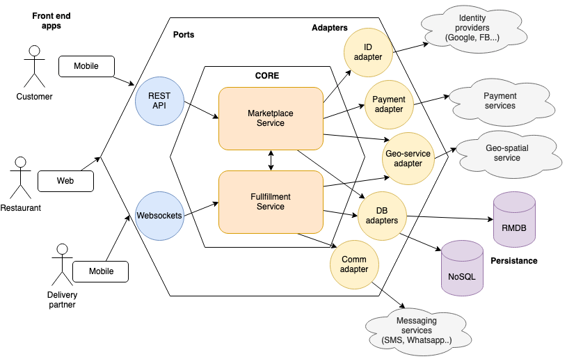

## Q 1
* Para el cliente, hay dos funcionalidades principales: comprar los productos, y acompañar el reparto.
* El primer componente se asemeja a una tienda web, por lo que puede ser un servicio una API REST.
El segundo necesita una comunicación constante entre el front-end y el back-end, y para esto es mejor utilizar Websockets.
* Los actores acceden al servicio por aplicación móvil para clientes y repartidores, y por aplicación web para restaurantes.
* Es igualmente necesario comunicarse con algunos componentes externos: servicios financieros para el pago, servicios de geolocalización para las rutas, proveedores de identidad, servicios de mensajería instantánea.

## Q 2
* En el diagrama es posible ver cómo se relacionan los diferentes componentes utilizando una arquitectura hexagonal.
* Es necesario separar los dos microservicios (compra y reparto) porque tienen formas de comunicación y demandas muy diferentes.
* Los adaptadores pueden ser componentes de los microservicios inicialmente, pero más adelante podrán ser convertidos en microservicios separados.

## Q 3
* Es importante seguir una metodología ágil, pero como tenemos un equipo pequeño, utilizar Scrum traería mucho overhead. Yo recomiendo utilizar los principios de Extreme Programming (pruebas unitarias, integración y entrega contínuas) junto con herramientas como Kanban. Estos principios permitirán al equipo generar valor de manera contínua.
* Lo más importante es que la metodología empleada no sea un estorbo para el desarrollo.

## Q 4
* Los commits deben seguir los patrones de [Conventional Commits](https://www.conventionalcommits.org/en/v1.0.0/#summary).
* Para el manejo de las ramas, se utilizará [Trunk Based Development](https://www.atlassian.com/continuous-delivery/continuous-integration/trunk-based-development)

## Q 5
* Me gustaría añadir otra persona para desarrollar el backend para que yo no sea el único que pueda escribir código, y también para permitir code reviews y pair programming. Si es una persona menos experimentada que yo, podrá encargarse de tareas más mecánicas, en particular de las integraciones con servicios externos.

* Después de la fase del prototipo, serán necesarios más servicios de atención a los clientes y partners, y no solamente el Impact Lead.

## Q 6
* Antes de desplegar una prueba de concepto al público, es importante que un abogado revise la política de privacidad, los términos de servicio y otras cuestiones legales.
* Es interesante considerar la necesidad de moderación de las imágenes y textos hechos por los restaurantes y clientes. Para esto es posible utilizar servicios de Machine Learning.
* También se puede utilizar los expertos de Data Science para ayudar a definir precios.

